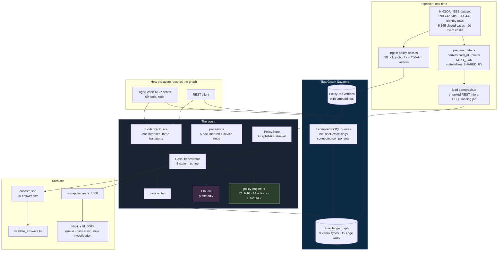
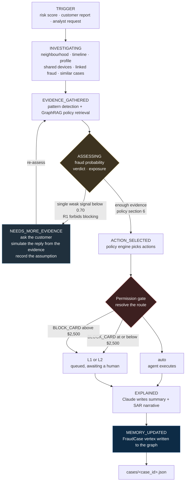
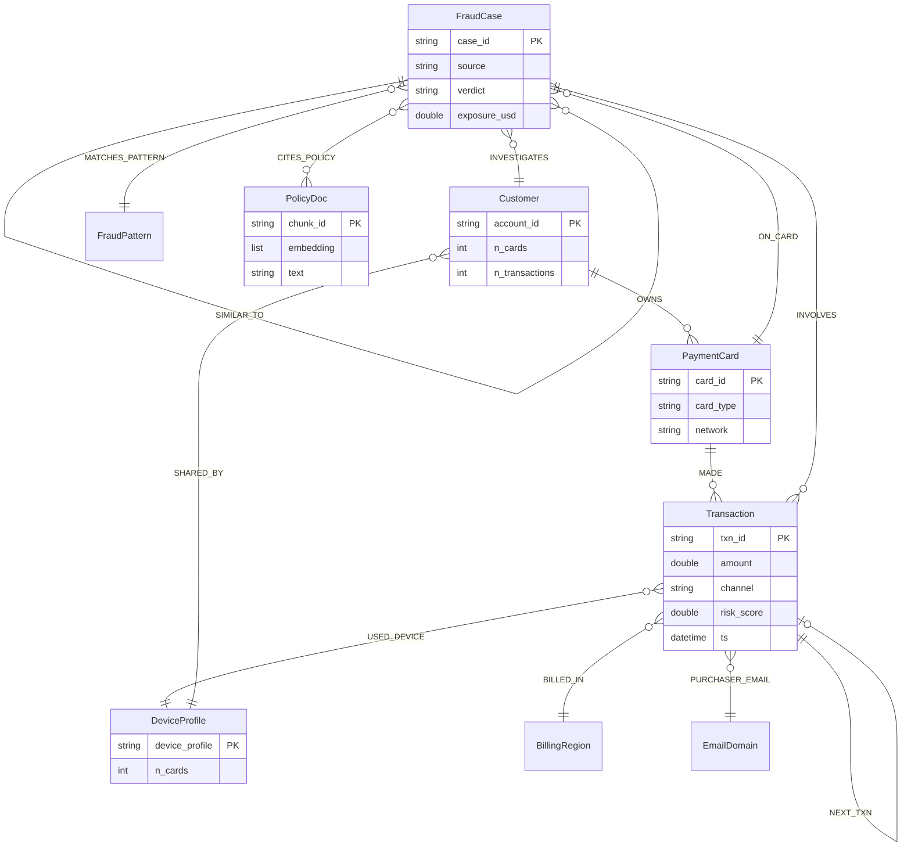
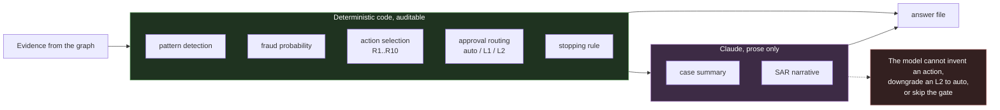
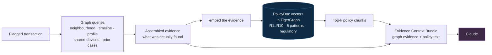
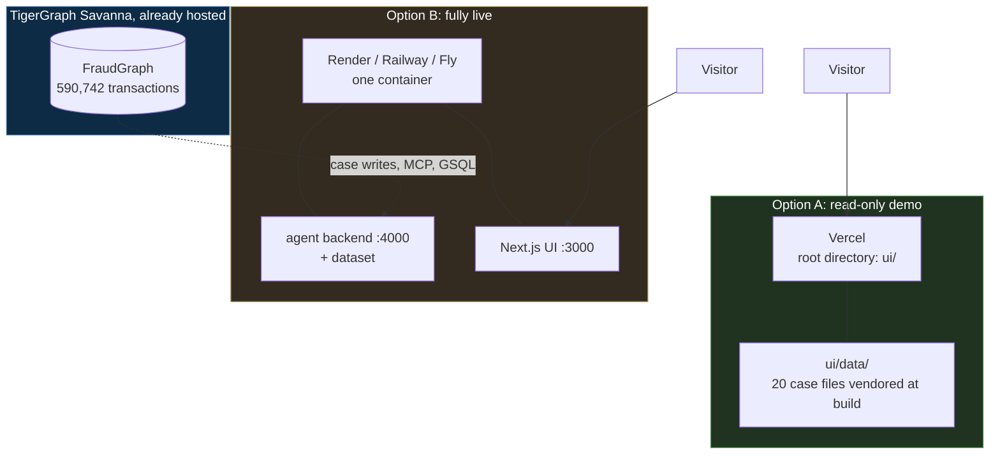

# Architecture diagrams

Mermaid source. Paste any block into <https://mermaid.live> to render and export
as PNG or SVG. GitHub, Notion and Obsidian render these inline as-is.

---

## 1. System overview

The one to use in the blog post and the slide.

---

## 2. The investigation flow

The eight steps, with the uncertainty loop and the permission gate.

---

## 3. The graph data model

`SHARED_BY` is the edge that earns its keep. "Which other cardholders used this
device" is one hop, and it is how the HHG-014 ring surfaces.

---

## 4. Where the LLM sits, and where it does not

The point of the whole design, in one picture.

---

## 5. GraphRAG, in one picture

Why retrieval here is graph-grounded rather than keyword-driven.

The query is the evidence, not a keyword. So a case showing a disputed charge on
a cardholder's own recurring pattern retrieves rule R7, and a case showing one
device across many cardholders retrieves R6 and R9.

---

## 6. Deployment

