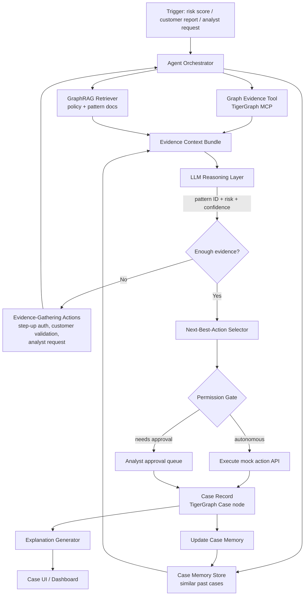

# System Architecture — TigerGraph Agentic Fraud Investigation Agent

Project: HHGOA TigerGraph Hackathon — Agentic Fraud Investigation & Next-Best-Action
Deadline: Sept 24, 2026, 11:59 PM IST

## 1. Design Principles

The scoring is weighted toward two things above everything else:

| Criterion | Weight |
|---|---|
| Investigation accuracy | 25% |
| Next best action | 25% |
| Agentic design & engineering | 15% |
| Innovation | 15% |
| Case summary & explainability | 10% |
| Demo quality | 10% |

Architecture decisions below are made to protect the 50% that comes from investigation accuracy and next-best-action quality, and to make explainability and agentic controls "free" side effects of the design rather than bolted-on features. Anything that doesn't move one of those needles is explicitly marked **cut candidate**.

Three hard constraints from the brief shape every component:
- There is **no ground-truth fraud label** in the transaction data — only a risk score. Fraud determination has to come from pattern evidence + policy + prior case outcomes, not a lookup.
- Every action beyond passive read/analyze must go through a **permission gate** — some are agent-autonomous, some require human approval.
- The agent must be able to say **"not enough evidence yet"** and go get more, then revise its recommendation — this loop is explicitly graded.

## 2. High-Level System Diagram



## 3. Component Breakdown

### 3.1 Graph Layer (TigerGraph)

This is the backbone. Everything else is a consumer of what this layer can answer.

**Node types**
- `Account` — customer account, holds risk profile fields
- `Card` — payment card, linked to one or more accounts
- `Transaction` — one row from the dataset, carries the bank's risk score
- `Device` — device fingerprint from the identity/device tables
- `IPAddress`, `Email`, `Address` — shared-identifier entities used to link otherwise-unconnected accounts
- `Case` — an investigation record (created by the agent, not present in raw data)
- `FraudPattern` — the 5 documented patterns from the dataset, plus any undocumented ones discovered
- `PolicyDoc` — chunked fraud policy / regulatory reference text (for GraphRAG grounding)

**Edge types**
- `(Account)-[:OWNS]->(Card)`
- `(Account)-[:MADE]->(Transaction)`
- `(Transaction)-[:USED_DEVICE]->(Device)`
- `(Transaction)-[:FROM_IP]->(IPAddress)`
- `(Account)-[:USES_EMAIL]->(Email)`, `(Account)-[:USES_ADDRESS]->(Address)`
- `(Device)-[:SHARED_BY]->(Account)` (derived edge — same device across accounts is a primary fraud signal)
- `(Case)-[:INVESTIGATES]->(Account|Transaction)`
- `(Case)-[:MATCHES_PATTERN]->(FraudPattern)`
- `(Case)-[:SIMILAR_TO]->(Case)` (derived from embedding similarity + shared entities, used for case memory retrieval)

**Core GSQL queries to write first** (these ARE the investigation-accuracy score — prioritize over everything else):
1. `getEntityNeighborhood(account_id, hops)` — pull the local subgraph around an account/transaction for context
2. `findSharedDevicesAcrossAccounts(account_id)` — device/IP/email reuse pattern
3. `findVelocityBursts(account_id, window)` — rapid transaction sequences
4. `findLinkedFraudHistory(account_id)` — does this entity touch any prior confirmed-fraud case, directly or within N hops
5. `findSimilarClosedCases(case_features)` — case-memory retrieval by structural + feature similarity
6. One query per **remaining documented pattern** in the dataset README (there are 5 total — read the README before finalizing #2–6; do not guess pattern definitions)

> Note: the dataset README defines the 5 fraud patterns precisely. Do not hardcode pattern logic from assumption — pull the exact definitions from `HHGOA_IEEE/README` before writing GSQL, and mirror the pattern names/IDs in `FraudPattern` nodes so the agent's output can cite them exactly.

> **Revised after reading the dataset README.** The node and edge lists above were written before anyone had seen the data, and three of them have no source:
> - `IPAddress` and `FROM_IP` are **dropped**. The dataset contains no IP column at all.
> - `Email` is `EmailDomain`, hanging off `Transaction`. The data has `P_emaildomain` / `R_emaildomain`, which are domains and not addresses, so a shared value links nothing.
> - `Address` is `BillingRegion`, hanging off `Transaction`. `addr1` is an anonymized region code and a property of the transaction.
> - `MADE` runs `Card -> Transaction`, not `Account -> Transaction`, and a `NEXT_TXN` per-card chain was added for sequence patterns.
>
> The implemented schema is `graph/schema.gsql`. The full table of deviations, with reasons, is in `graph/load/README.md`. Note also that the dataset has no `card_id` column even though the case pack references cards by id; the derivation is documented there and is verified on every data prep.

### 3.2 GraphRAG Layer

Purpose: ground the LLM in **retrieved, structured evidence** — never raw table dumps.

- Chunk and embed: fraud policy doc, the 5 pattern descriptions, regulatory references, and the closed-case narratives.
- Store embeddings in **TigerGraph's vector store**, attached to `PolicyDoc` and `Case` vertices.

> **Revised after reading the dataset README.** This section originally specified Postgres + `pgvector`. The hackathon brief lists TigerGraph vector storage and retrieval as a required component, and the dataset README explicitly directs the policy text, pattern descriptions, regulatory documents and closed-case narratives into TigerGraph vector search. Keeping embeddings in TigerGraph also removes Postgres from the stack entirely (see §3.5), which is one less dependency to install and debug against the deadline, and it makes "similar prior cases" a single store's problem: graph traversal for shared entities and vector similarity for narrative text, over the same `Case` vertices.
- Retrieval is triggered per-case, not per-query: given the graph evidence bundle for a case, retrieve top-k relevant policy/pattern chunks.
- Retrieved chunks + graph evidence are assembled into one structured **Evidence Context Bundle** (JSON) before ever reaching the LLM — the LLM never sees raw transaction rows in bulk, it sees: entities involved, pattern matches found, prior similar cases, and the relevant policy text.

**Cut candidate:** a general-purpose RAG over the entire dataset. Not needed — GraphRAG here should only cover policy/pattern text, since transactional evidence comes from the graph queries directly.

### 3.3 Agent Orchestrator

Implements the mandated 8-step flow as an explicit state machine, not a black-box agent loop. Each state transition is logged into the case record — this logging *is* the explainability requirement, not a separate feature.

States: `TRIGGERED → INVESTIGATING → EVIDENCE_GATHERED → ASSESSING → (loop: NEEDS_MORE_EVIDENCE → EVIDENCE_GATHERED) → ACTION_SELECTED → EXPLAINED → MEMORY_UPDATED → CLOSED`

Given the time budget, implement this as a plain TypeScript state machine/service (a `CaseOrchestrator` class with one method per state) rather than adopting a new agent framework mid-hackathon. If already comfortable with LangGraph, it maps cleanly onto the same states — use it only if it saves time, not because it's expected.

### 3.4 LLM Reasoning Layer

Every LLM call has a fixed structured-output contract (JSON schema), never free text, so the case record stays machine-usable:

| Call | Input | Output schema |
|---|---|---|
| Pattern identification | Evidence Context Bundle | `{pattern, pattern_description, confidence: 0-1, rationale}` |
| Risk assessment | patterns + prior case outcomes | `{fraud_probability: 0-1, verdict, key_factors}` |
| Evidence sufficiency | current evidence + risk assessment | `{sufficient: bool, missing_evidence: [...], requested_action?}` |
| Next-best-action | full case state | `{actions: [{action, route, reason}]}` |
| Explanation | full case state | human-readable summary referencing evidence used |

> **Revised after reading the dataset README.** The original schemas here were invented before anyone had seen the answer format. They have been replaced with the vocabulary the deliverable actually requires: `pattern` is one of seven literal enum values, `verdict` is `fraud|legitimate|uncertain`, `fraud_probability` replaces a `risk_level` band and is scored for calibration, and `action` must be one of the fourteen policy identifiers with a `reason` citing a policy rule id. `agent.md` §6 carries the full answer-file schema; treat the dataset README as authoritative over both.

The LLM's job is reasoning and synthesis over what the graph already found — it should never be asked to "find fraud" unassisted from raw data.

### 3.5 Case Memory Store

- **System of record:** the `Case` vertex in TigerGraph, carrying status, verdict, pattern, exposure, decisions and outcome. The bank's 5,565 closed cases load into the same vertex type with `source="closed_history"`, so the agent's cases and the bank's history are one corpus.
- **Relationship view:** `INVOLVES`, `ON_CARD`, `CONNECTED_TO`, `MATCHES_PATTERN` and `SIMILAR_TO` edges, so similarity and linkage queries (§3.1 query 5) traverse shared entities between the new case and historical ones.
- Retrieval for a new case = graph-linked similar cases (shared device, card, region or pattern) UNION vector similarity on case narrative text, deduplicated.
- Update on close: write outcome, decisions taken, and final pattern classification back so future cases benefit, and set `written_to_graph` / `graph_case_id` in the answer file.

> **Revised after reading the dataset README.** Postgres was originally the system of record, mirrored into TigerGraph. Postgres has been dropped entirely: the brief requires TigerGraph for vector storage and retrieval, the case corpus is small (5,565 historical plus 20 new), and a single store removes a cross-store join, a second schema, a migration step and an install from a two-day build. The tradeoff is losing SQL for ad-hoc inspection of case records; `ls` and plain GSQL selects cover what the demo needs.

### 3.6 Actions / Tools Layer

All actions are **stubbed/mocked** per the brief — implement as simple functions with a consistent signature and a permission check.

| Action | Route | Notes |
|---|---|---|
| `ALLOW_TRANSACTION` | `auto` | Let the flagged transaction stand |
| `MONITOR_CARD` | `auto` | Card stays active, monitoring raised for 72 hours |
| `MONITOR_CONNECTED_CARDS` | `auto` | Cards sharing a device profile, region cluster or ring |
| `WARN_CUSTOMER` | `auto` | Informational message, reversible |
| `VERIFY_WITH_CUSTOMER` | `auto` | Evidence gathering: `customer_validation` |
| `STEP_UP_AUTH` | `auto` | Evidence gathering: `step_up_auth` |
| `ESCALATE_TO_ANALYST` | `auto` | Evidence gathering: `analyst_info`; always available fallback |
| `GENERATE_REPORT` | `auto` | Internal write-up without opening a case |
| `CREATE_CASE` | `auto` | Opens the internal case and writes it to the graph |
| `CLOSE_NO_FRAUD` | `auto` | Close the alert as legitimate |
| `DECLINE_TRANSACTION` | `L1` | Declines the authorization only, card stays active |
| `BLOCK_CARD` | `L1` at exposure ≤ $2,500, `L2` above | Block and reissue; the one conditional route |
| `BLOCK_ALL_CARDS` | `L2` | Only under R10 |
| `FILE_REPORT` | `L2` | Regulatory filing; only when `sar_criteria` are met |

The permission matrix is read from `config/permissions.json`, never hardcoded. This makes "operates within policies and permissions" visibly demonstrable in the demo (show the config, show the gate firing). Action selection itself is rule-driven from `config/policy_rules.json`, which holds policy rules R1 to R10, the SAR criteria, the case-creation criteria and the stopping criteria.

> **Revised after reading the dataset README.** The original table invented nine action names and a boolean `requires_approval`. Both were wrong. The dataset's Fraud Policy defines fourteen exact identifiers that the answer format requires verbatim, and a three-level routing model (`auto`, `L1`, `L2`) in which one route is conditional on exposure. An invented action name scores zero for that case, so this table is a hard contract, not a design suggestion.

### 3.7 UI Layer

Single-purpose case view (Next.js — matches existing stack), not a full multi-page dashboard:
- Evidence timeline (what was gathered, in order, with source)
- Pattern matches with confidence
- Risk/confidence indicator
- Reasoning trace (the explanation output, not a raw LLM transcript)
- Recommended action(s) with an approve/reject control for gated actions
- Case status

**Cut candidate:** account-level dashboards, analyst login/auth, multi-case queue views. One clean case page, reachable per case ID, is sufficient for the demo and the 10% "demo quality" criterion.

## 4. Data Flow Through the 8-Step Flow

| Step | Component(s) | Output persisted |
|---|---|---|
| 1. Trigger | Orchestrator entrypoint | `Case` created, status `TRIGGERED` |
| 2. Investigate | Graph tool (§3.1 query 1) | Local subgraph snapshot attached to case |
| 3. Gather evidence | Graph tool (pattern queries) + GraphRAG | `case_evidence` rows |
| 4. Assess uncertainty | LLM reasoning layer | Risk assessment + confidence written to case |
| 5. Gather more (if needed) | Evidence-gathering actions | New evidence rows, loop back to step 3/4 |
| 6. Next action | Next-best-action LLM call + permission gate | `case_decisions` row, action executed or queued |
| 7. Explain | Explanation LLM call | Explanation text attached to case, shown in UI |
| 8. Update memory | Case memory store | Case + outcome written to TigerGraph (`Case` vertex + edges) |

## 5. Repository Structure

```
/
├── CLAUDE.md
├── agent.md
├── build_plan.md
├── docs/
│   └── architecture.md
├── cases/                     # the 20 answer files, <case_id>.json (the deliverable)
├── graph/
│   ├── schema.gsql
│   ├── load/                 # GSQL loading jobs + data prep scripts
│   └── queries/               # one .gsql file per query in §3.1
├── src/
│   ├── orchestrator/          # CaseOrchestrator state machine
│   ├── tools/
│   │   ├── graph-tool.ts      # wraps TigerGraph MCP calls
│   │   ├── graphrag.ts        # policy/pattern retrieval
│   │   └── actions/           # one file per mock action
│   ├── llm/                   # prompt templates + structured-output parsing
│   ├── memory/                # case memory read/write
│   └── api/                   # backend endpoints for the UI
├── ui/                        # Next.js case view
├── data/
│   └── HHGOA_IEEE/             # dataset (gitignored if large)
├── benchmarks/
│   └── run_benchmark.ts       # runs all 20 cases, writes cases/<case_id>.json
└── config/
    ├── permissions.json       # the 14 actions and their routes
    └── policy_rules.json      # R1-R10, SAR criteria, stopping criteria
```

> **Revised after reading the dataset README.** Answer files go in a top-level `cases/` folder named `<case_id>.json`, which is what the submission requires; `benchmarks/output/` was invented. The benchmark runner writes there directly.

## 6. Tech Stack

| Layer | Choice | Why |
|---|---|---|
| Graph DB | TigerGraph (Savanna, auto-stop on) | Required by brief |
| Graph access | TigerGraph MCP | Required by brief |
| Backend | Node.js / TypeScript | Existing fluency, fast iteration |
| Vector store | TigerGraph vector search | Required component per the brief; keeps case memory in one store |
| LLM | Claude (via API) | Structured output support, tool use |
| Agent orchestration | Custom TS state machine | Full control, no framework overhead to learn |
| UI | Next.js | Existing fluency |
| Case memory | TigerGraph `Case` vertices (records, edges and narrative embeddings in one store) | One store to write, traverse and search; no cross-store join |

## 7. Non-Functional Requirements

- **Auditability:** every case must reconstruct, from stored data alone, exactly what evidence was seen and why each decision was made — this is graded directly (case summary & explainability, 10%) and indirectly (defensibility of actions, part of next-best-action, 25%).
- **Policy compliance:** any action classified as requiring approval must never execute without an approval record, even in the mocked/demo environment.
- **Latency:** not graded directly, but keep single-case processing under ~30s so all 20 benchmark cases can be run and re-run quickly during debugging.

## 8. Cut List (if time runs short, cut in this order)

1. UI polish beyond a single functional case page
2. Additional undocumented fraud pattern discovery (nice-to-have for innovation, not required)
3. Graph algorithms beyond targeted traversal queries (PageRank/community detection)
4. Multi-model LLM comparison
5. Anything not required to produce the 20 benchmark case answer files correctly — that deliverable is graded identically for every team and is non-negotiable
